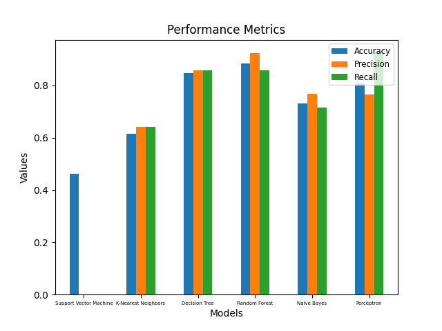

# IPLay

This repository contains the source code for the IPLay project, a simple supervised machine learning program that can classify whether a given IPL team will qualify for the playoffs or not.
The `script.py` file is responsible for the web scraping and data collection, while the `model.py` file is responsible for the machine learning model.

## Introduction

The Indian Premier League (IPL) is the most famous cricket league in the world, where 10 teams compete against each other to win the title. The league is played in a round-robin format, where each team plays against each other twice. At the end of the league stage, the top 4 teams qualify for the playoffs, where the top 2 teams play against each other in the first qualifier, and the 3rd and 4th teams play against each other in the eliminator. The winner of the eliminator plays against the loser of the first qualifier in the second qualifier, and the winner of the second qualifier plays against the winner of the first qualifier in the final. The winner of the final is crowned the champion of the IPL.
The goal of this project is to predict whether a given IPL team will qualify for the playoffs or not, based on the general performance of any team in the previous seasons of the IPL.

## Data Collection

The data for this project was collected from the [IPL website](https://www.iplt20.com/), using the `selenium` and `BeautifulSoup` libraries in Python. The data was collected for the seasons 2008-2022.

## Results

The following classifiers were used to train the model:

1. Support Vector Machine
2. K-Nearest Neighbors
3. Decision Tree
4. Random Forest
5. Multinomial Naive Bayes
6. Multi-Layer Perceptron

The accuracies, precisions, and recalls were then plotted for each classifier, and the following results were obtained:

## Conclusion

The Random Forest classifier and the Decision Tree classifier were found to be the best classifiers for this problem, with an accuracy of 0.88 and 0.84 respectively.
